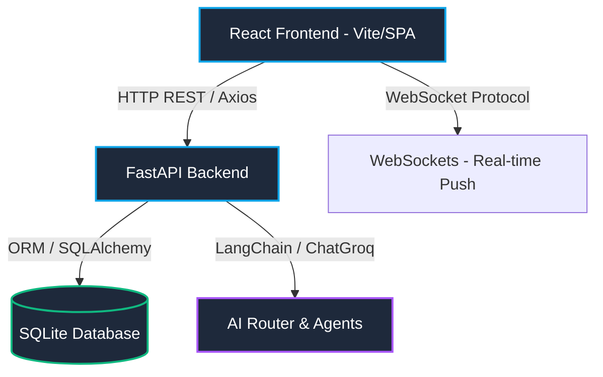
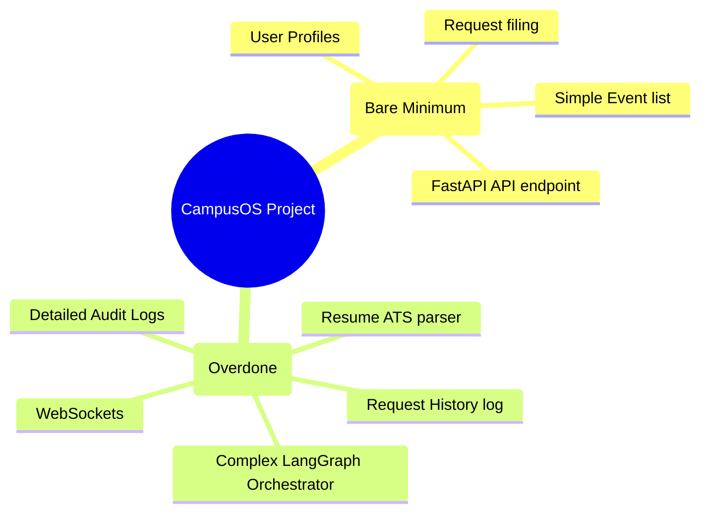
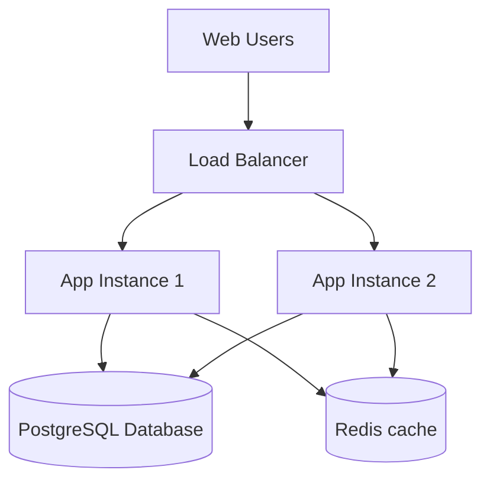

# CampusOS: The Complete Developer Guide

Welcome to **CampusOS**! This guide is designed to help you understand the architecture, technologies, data schemas, security, and scaling paths of this AI-integrated college portal. Technical terms are followed by their meanings in brackets to help you get up to speed quickly.

---

## 1. System Architecture & Tech Stack

Here is a look at how the different parts of CampusOS connect:

### The Tech Stack (Technologies Used)
Here are the libraries and technologies used in the project:

| Technology / Library | Purpose in CampusOS | Meaning / Definition |
| :--- | :--- | :--- |
| **FastAPI** | Backend Web Framework | **FastAPI** (asynchronous, high-performance web framework for Python to build REST APIs). |
| **SQLAlchemy** | Database ORM | **ORM** (Object-Relational Mapping, a technique that lets you query and manipulate databases using Python classes instead of raw SQL code). |
| **SQLite** | Database Engine | **SQLite** (a lightweight, serverless database engine that stores data in a single local file). |
| **LangChain** | AI Agent Orchestrator | **LangChain** (a library/framework designed to wrap Large Language Models, manage prompts, and chain multiple AI steps together). |
| **ChatGroq** | LLM Provider | **LLM** (Large Language Model, an AI program trained to understand, classify, and generate human-like text). |
| **React** | Frontend Framework | **SPA** (Single Page Application, a web framework that dynamically updates web pages without full browser reloads). |
| **Axios** | API Fetching | **HTTP Client** (a library used by the frontend to send requests like GET, POST, and PUT to the backend API). |
| **Vite** | Frontend Bundler | **Bundler** (a development server and builder tool that packages JavaScript, JSX, and CSS files quickly). |
| **Tailwind CSS** | Styling | **CSS Utility Framework** (a framework that lets you style HTML elements directly using predefined utility class names). |
| **Lucide React** | UI Icons | **Icon Library** (a collection of clean, modern vector icons packaged as React components). |

---

## 2. Database Schema (How Data is Organized)

CampusOS runs on SQLite and maps relational tables to Python models via SQLAlchemy. Below is the structure of the active tables:

### Users Table (`users`)
Stores profile information for both students and administrators.
* **Columns**:
  * `id` (`Integer`, Primary Key): Unique identifier.
  * `name` (`String`): User's full name.
  * `email` (`String`, Unique): Used as login username.
  * `password_hash` (`String`): Securely encrypted password.
  * `role` (`String`): User permissions (`Student` or `Admin`).
  * `status` (`String`): Access state (`Active` or `Suspended`).
  * `cgpa` (`Float`): Academic GPA (for Placement eligibility checks).
  * `backlogs` (`Integer`): Count of failed exams (for Placement checks).
  * `roll_number` (`String`): Registration identifier.
  * `department` (`String`): Academic branch (e.g., "CSE").

### Requests Table (`requests`)
Tracks student requests like Leave applications or Bonafide certificates.
* **Columns**:
  * `id` (`Integer`, Primary Key): Request identifier.
  * `student_id` (`Integer`, Foreign Key -> `users.id`): Student who filed it.
  * `type` (`String`): Request category (`Bonafide Certificate`, `Leave Application`, `Doubt Clearance`).
  * `details` (`String`): Explanatory note or reasoning.
  * `status` (`String`): Current stage (`Pending`, `Under Review`, `Approved`, `Rejected`, `Completed`).
  * `created_at` (`DateTime`): Timestamp of creation.

### Request History Table (`request_histories`)
Logs transitions of request status for transparency.
* **Columns**:
  * `id` (`Integer`, Primary Key): History entry identifier.
  * `request_id` (`Integer`, Foreign Key -> `requests.id`): Associated request.
  * `previous_status` (`String`, Nullable): Stage before change.
  * `new_status` (`String`): Updated stage.
  * `changed_by` (`Integer`, Foreign Key -> `users.id`): Staff or student committing change.
  * `note` (`String`): Decision explanation note.
  * `timestamp` (`DateTime`): Time of audit event.

### Events Table (`events`)
Campus events registry managed by Admins.
* **Columns**:
  * `id` (`Integer`, Primary Key): Event identifier.
  * `title` (`String`, Unique): Event name.
  * `category` (`String`): Categorization (`Workshop`, `Hackathon`, `Seminar`).
  * `description` (`String`): Description details.
  * `venue` (`String`): Location.
  * `start_datetime` / `end_datetime` (`DateTime`): Schedule times.
  * `published` (`Boolean`): Toggle draft status (Draft vs Visible to students).
  * `max_participants` (`Integer`): Booking limits.
  * `created_by` (`Integer`, Foreign Key -> `users.id`): Admin who created it.

### Event Registrations Table (`event_registrations`)
Registers bookings for published events.
* **Columns**:
  * `id` (`Integer`, Primary Key): Registration ID.
  * `event_id` (`Integer`, Foreign Key -> `events.id`): Connected event.
  * `student_id` (`Integer`, Foreign Key -> `users.id`): Registered student.
  * `registered_at` (`DateTime`): Registration time.
  * `status` (`String`): Registration state (`Registered` or `Cancelled`).

### Notifications Table (`notifications`)
Stores alerts for users. Pushed via WebSockets.
* **Columns**:
  * `id` (`Integer`, Primary Key): Notification ID.
  * `recipient_id` (`Integer`, Foreign Key -> `users.id`): User receiving the alert.
  * `title` / `message` (`String`): Alert header and details.
  * `type` (`String`): Notification type (`RequestStatus`, `NewEvent`, `EventUpdate`).
  * `read` (`Boolean`): True if clicked/viewed.
  * `created_at` (`DateTime`): Timestamp.

---

## 3. The Bare Minimum (What to Strip / What we Overdid)

If you want to build the absolute bare minimum version of this project to show a demo without full complexities, here is what you can strip out:

### What we Overdid:
1. **LangGraph Router Nodes**: Using a full agent state graph with Supervisor nodes just to classify a prompt. A standard ChatPromptTemplate or regex classifier is sufficient.
2. **Audit Logging & Histories**: Logging every single status change in a separate relational table (`request_histories` and `audit_logs`). 
3. **Resume ATS Parser**: The resume upload and processing module requires PDF processing libraries and LLM API cost overhead.
4. **WebSocket Live Updates**: Students can fetch updates by clicking refresh instead of maintaining WebSockets.

### What is Absolutely Necessary to keep:
1. **User Authentication**: Login and Register endpoints to verify student identity.
2. **Requests and Events Tables**: To submit requests and read events.
3. **FastAPI router endpoints**: Core REST endpoints to serve database reads/writes.

---

## 4. Moving to MongoDB (The NoSQL Alternative)

**NoSQL** (Not Only SQL, a database engine that stores data in unstructured document formats like JSON instead of strict rows and columns).

### Where MongoDB is useful in this project:
* **Chatbot Transcripts**: LLM conversational histories grow dynamically and have unstructured formats. Storing them in MongoDB documents is more natural than flat relational rows.
* **Audit Logs**: System logs and audit changes are semi-structured records. MongoDB allows storing flexible documents without modifying schemas.
* **Resume Parse Caches**: Storing parsed resume JSON structures.

### SQLite vs MongoDB:
| Metric | SQLite (Relational SQL) | MongoDB (Document NoSQL) |
| :--- | :--- | :--- |
| **Data Format** | Strict tables (rows & columns) | Flexible documents (BSON/JSON) |
| **Relationships** | High (using Foreign Keys and Joins) | Embedded documents or manual references |
| **Setup Overhead** | Zero (stored in a single file) | Requires database server process |
| **ACID Transactions** | Robust support out-of-the-box | Supported, but requires manual configuration |

---

## 5. Drawbacks of the Project

1. **SQLite Database Locking**: SQLite locks the database file on writes. Under multi-user load, writes will fail due to database locking.
2. **Local File Uploads**: Resumes are uploaded to local folders. In production, this causes data loss on server restarts.
3. **No LLM Rate Limiting**: Malicious users can send infinite chat queries, which will drain API credits instantly.
4. **No Chat History Limits**: Chat history keeps appending messages to LLM prompts, leading to slow response times and token limits.

---

## 6. Security Analysis (Is it Secure?)

Let's audit the security model of CampusOS:

### Current Preventive Measures (Security Checks):
* **Password Hashing**: Uses bcrypt to hash passwords. Plain text passwords are never stored.
* **RBAC (Role-Based Access Control)**: Backend API paths are wrapped in `require_admin` dependency checks to prevent students from calling admin routes.
* **JWT Authentication**: Protects student routes. JWT tokens are verified on every API request.
* **PDF Upload Security Checks**: Verifies `.pdf` extensions and restricts resume uploads to a 5MB size limit to prevent resource exhaustion attacks.

### Vulnerability Areas (How can a malicious user attack?):
1. **XSS (Cross-Site Scripting)**: Access tokens are stored in `localStorage` in the browser. If a script injection occurs, attackers can read the token.
2. **No Rate Limiting**: An attacker can script thousands of login requests or AI prompts to crash the backend server (DoS / Denial of Service attack).
3. **Prompt Injection**: Users can input text to command the routing LLM to bypass system rules.
4. **CORS Configuration**: The allowed origins list might be set too broadly in developmental configs (`*`), letting foreign sites request the backend.

---

## 7. Scaling and Deployment Guide

### Scaling to Production:
To scale this application to support thousands of active users, follow this checklist:

1. **Database Migration**: Swap SQLite for **PostgreSQL** or **MySQL** (relational database servers that handle thousands of concurrent read/write transactions).
2. **State Decoupling**: Make the FastAPI server completely stateless. Move uploaded files to object storage (like Google Cloud Storage or AWS S3).
3. **Caching with Redis**: Use **Redis** (in-memory key-value cache database) to cache event listings and timetable schedules to decrease database load.
4. **JWT Security Upgrade**: Store JWT tokens in secure, `HttpOnly` cookies to protect against token theft via XSS scripts.

### Deployment Options:
* **Frontend**: Deploy to **Vercel** or **Netlify** (static hosting platforms).
* **Backend**: Containerize using **Docker** and deploy to:
  * **Render** or **Railway** (simple App Hosting).
  * **Google Cloud Run** (Serverless container containerized autoscaler).
  * **PostgreSQL Database**: Host on **Supabase** or **Neon**.
