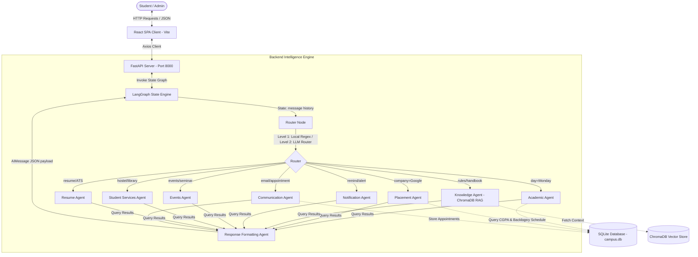

# CampusOS AI — Smart Campus Assistant

CampusOS AI is an intelligent, multi-agent academic assistant and administrative coordinator designed to streamline student queries, schedule verification, placement eligibility audits, and general campus operations.

---

## 🚀 Key Features

*   **Intelligent Two-Level Routing:** Combines a local deterministic Regex router (Level 1) to handle common keyword commands instantly with zero latency, and an LLM semantic router (Level 2, via Groq) for complex reasoning and parameter extraction.
*   **Multi-Agent Coordination:** Orchestrates a network of 9 specialized AI agents (Academics, Placements, Events, Student Services, Resume, Communication, etc.) using LangGraph.
*   **Real Database Validation:** Connects directly to a SQLite database (`campus.db`) to audit real student records, CGPA, and backlog data.
*   **Retrieval-Augmented Generation (RAG):** Integrates ChromaDB to index, retrieve, and answer student questions based on official college PDFs (student handbooks, academic rule sheets).
*   **Email & Appointment Tools:** Automatically drafts formatted communication emails and schedules appointments with campus officers directly in the database.

---

## 📐 Architecture & Data Flow

The system coordinates student and admin queries through a structured, single-node supervisor state machine managed by LangGraph:



---

## 🛠️ Tech Stack

*   **Frontend:** React (Vite), Tailwind CSS, Lucide Icons, Axios, React Router.
*   **Backend:** Python 3.10+, FastAPI, LangGraph, LangChain Community Core.
*   **AI Models:** LLM processing via Groq, embeddings via FastEmbed.
*   **Storage & Database:** SQLite (SQLAlchemy ORM), ChromaDB (Vector Store).

---

## 📂 Project Structure

```text
agentx/
├── backend/
│   ├── agents/            # Specialized agent definitions (Academic, Placement, etc.)
│   ├── api/               # FastAPI schemas and route controller endpoints
│   ├── core/              # Security and config settings
│   ├── data/              # Source PDFs and mock JSON datasets
│   ├── database/          # SQLite schema (models.py) and connection session config
│   ├── scripts/           # DB Seeding and JSON migration utilities
│   ├── graph.py           # LangGraph StateGraph compile setup
│   ├── main.py            # FastAPI App root & CORSMiddleware configuration
│   ├── nodes.py           # Main Router node routing payload logic
│   └── requirements.txt   # Python dependency lockfile
├── docs/                  # System architecture and tracker notes
├── frontend/
│   ├── src/               # React client source files (Components, Hooks, Pages)
│   ├── package.json       # Node package manager configuration
│   └── vite.config.js     # Vite compiler configuration
├── app.py                 # Sandbox server launcher
└── requirements.txt       # Unified Python dependencies
```

---

## 💻 Setup & Installation

### 1. Configure the Python Virtual Environment
Navigate to the root directory and create a standard Python virtual environment:
```bash
python -m venv venv
venv\Scripts\activate      # On Windows
source venv/bin/activate    # On Linux/macOS
pip install -r requirements.txt
```

### 2. Initialize and Seed the Database
Seed the SQLite database with mock student, timetables, and admin records:
```bash
python backend/scripts/seed_db.py
```
To migrate any existing legacy JSON files into SQLite:
```bash
python backend/scripts/migrate_json_to_sqlite.py
```

### 3. Launch the Backend Server
Start the Uvicorn FastAPI server on port 8000:
```bash
python -m uvicorn backend.main:app --port 8000 --reload
```

### 4. Setup and Launch the Frontend Client
Open a new terminal window, navigate to the frontend folder, and boot up the Vite server:
```bash
cd frontend
npm install
npm run dev
```
Open [http://localhost:5173](http://localhost:5173) in your browser to interact with the application.

---

## ⚙️ Engineering Challenges Resolved

1.  **Offline Resiliency (Double-Layered Routing):** Relying solely on external LLMs to route queries introduces latency and breaks if API keys expire. We implemented a local, regex-based Level-1 router targeting campus keywords (e.g. `timetable`, `hostel`, `CGPA`). This guarantees instantaneous response times for standard queries and acts as a bulletproof fallback.
2.  **Schema Consistency in LangGraph:** To prevent LangGraph from looping indefinitely or returning loose text strings, we locked all sub-agent responses into structured JSON dictionaries inside `nodes.py`. The `Response Agent` is the final gatekeeper, ensuring the frontend always receives clean, structured data.
