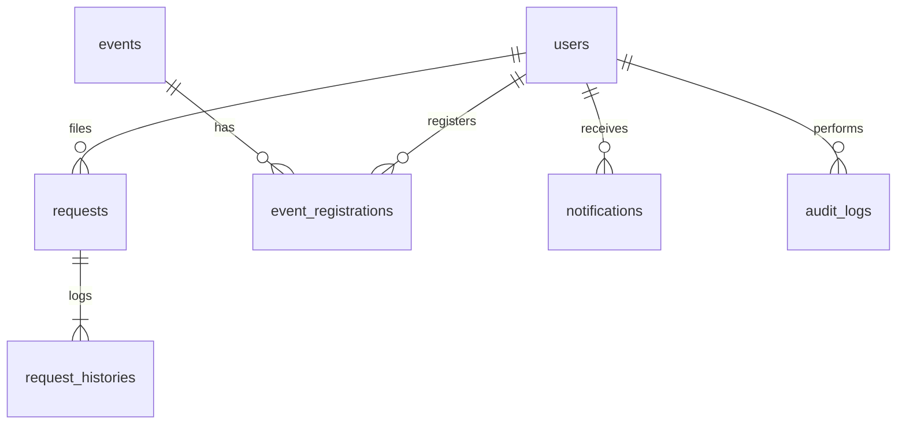

# CampusOS Database Specification

This document defines the relational database schemas, integrity rules, and database migrations for the CampusOS application.

## 1. Relational Entity Relationship Diagrams (Logical)

## 2. Table Specifications

### Users Table (`users`)
*   `id` (`Integer`, Primary Key, Autoincrement)
*   `name` (`String`, Not Null)
*   `email` (`String`, Unique, Indexed, Not Null)
*   `password_hash` (`String`, Not Null)
*   `role` (`String`, Default 'Student', Not Null) - `Student` | `Admin`
*   `status` (`String`, Default 'Active', Not Null) - `Active` | `Suspended`
*   `cgpa` (`Float`, Default 0.0, Not Null)
*   `backlogs` (`Integer`, Default 0, Not Null)
*   `roll_number` (`String`, Nullable)
*   `department` (`String`, Nullable)
*   `created_at` (`DateTime`, Default current time, Not Null)

### Requests Table (`requests`)
*   `id` (`Integer`, Primary Key, Autoincrement)
*   `student_id` (`Integer`, Foreign Key -> `users.id`, Indexed, Not Null)
*   `type` (`String`, Not Null) - `Bonafide Certificate` | `Leave Application` | `Doubt Clearance`
*   `details` (`String`, Not Null)
*   `status` (`String`, Default 'Pending', Not Null) - `Pending` | `Under Review` | `Approved` | `Rejected` | `Completed`
*   `created_at` (`DateTime`, Default current time, Not Null)

### Request Histories Table (`request_histories`)
*   `id` (`Integer`, Primary Key, Autoincrement)
*   `request_id` (`Integer`, Foreign Key -> `requests.id`, Indexed, Not Null, OnDelete CASCADE)
*   `previous_status` (`String`, Nullable)
*   `new_status` (`String`, Not Null)
*   `changed_by` (`Integer`, Foreign Key -> `users.id`, Not Null)
*   `note` (`String`, Nullable)
*   `timestamp` (`DateTime`, Default current time, Not Null)

### Events Table (`events`)
*   `id` (`Integer`, Primary Key, Autoincrement)
*   `title` (`String`, Unique, Indexed, Not Null)
*   `category` (`String`, Not Null) - `Event` | `Hackathon` | `Seminar` | `Workshop` | `Competition` | `Guest Lecture`
*   `description` (`String`, Not Null)
*   `venue` (`String`, Not Null)
*   `start_datetime` (`DateTime`, Not Null)
*   `end_datetime` (`DateTime`, Not Null)
*   `registration_link` (`String`, Nullable)
*   `max_participants` (`Integer`, Default 0, Not Null)
*   `published` (`Boolean`, Default False, Not Null)
*   `created_by` (`Integer`, Foreign Key -> `users.id`, Not Null)
*   `created_at` (`DateTime`, Default current time, Not Null)

### Event Registrations Table (`event_registrations`)
*   `id` (`Integer`, Primary Key, Autoincrement)
*   `event_id` (`Integer`, Foreign Key -> `events.id`, Indexed, Not Null, OnDelete CASCADE)
*   `student_id` (`Integer`, Foreign Key -> `users.id`, Indexed, Not Null, OnDelete CASCADE)
*   `registered_at` (`DateTime`, Default current time, Not Null)
*   `status` (`String`, Default 'Registered', Not Null) - `Registered` | `Cancelled`

### Notifications Table (`notifications`)
*   `id` (`Integer`, Primary Key, Autoincrement)
*   `recipient_id` (`Integer`, Foreign Key -> `users.id`, Indexed, Not Null, OnDelete CASCADE)
*   `title` (`String`, Not Null)
*   `message` (`String`, Not Null)
*   `type` (`String`, Not Null) - `RequestStatus` | `NewEvent` | `EventUpdate` | `Reminder`
*   `related_type` (`String`, Nullable)
*   `related_id` (`Integer`, Nullable)
*   `read` (`Boolean`, Default False, Not Null)
*   `created_at` (`DateTime`, Default current time, Not Null)

---

## 3. Migration and Multi-Database Support
*   **Alembic Integration**: Alembic will track schema version logs.
*   **Database Engine Independence**:
  *   **Development**: SQLite file (`campus.db`).
  *   **Production**: PostgreSQL database engine with connection pooling enabled.
  *   Environment variables dictate connection strings (`DATABASE_URL`).
